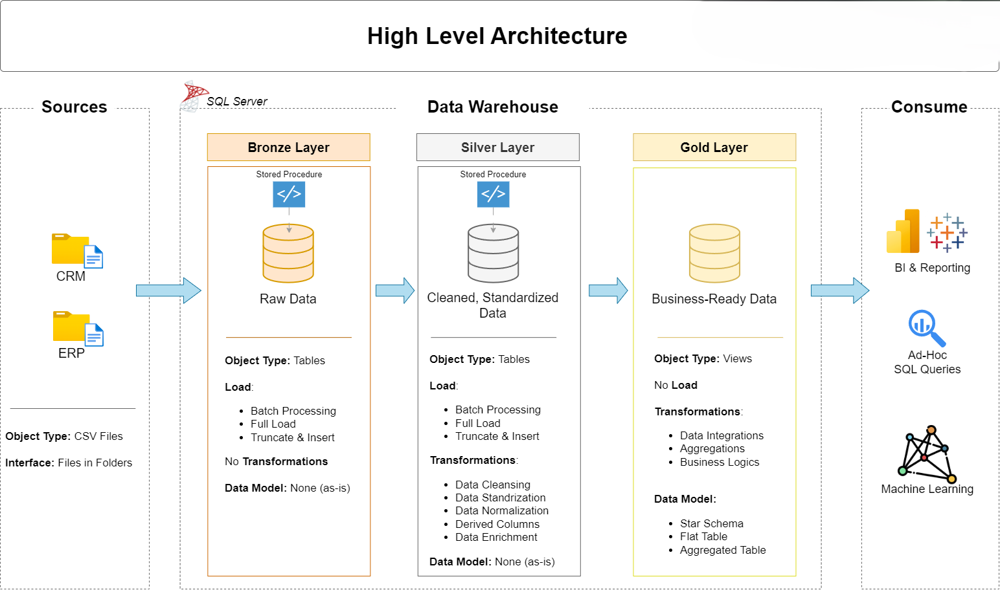

# 🚀 Data Warehouse & Analytics Project

A complete **end-to-end Data Engineering and Analytics solution** showcasing how to design, build, and analyze a modern data warehouse using industry best practices.

This project demonstrates the full lifecycle—from raw data ingestion to delivering actionable business insights—making it an ideal **portfolio project for aspiring Data Engineers and Data Analysts**.

---

## 🏗️ Data Architecture

This project follows the **Medallion Architecture** pattern:

- **Bronze Layer (Raw Data)**  
  - Stores raw data as-is from source systems  
  - Data ingested from CSV files into SQL Server  

- **Silver Layer (Cleaned & Transformed Data)**  
  - Data cleansing, validation, and standardization  
  - Handles missing values, duplicates, and inconsistencies  

- **Gold Layer (Business-Ready Data)**  
  - Optimized for analytics and reporting  
  - Designed using **Star Schema (Fact & Dimension tables)**  

📌 *Architecture Diagram:*  


---

## 📖 Project Overview

This project includes:

### 🔹 Data Engineering
- Designing a **modern data warehouse**
- Building **ETL pipelines** (Extract, Transform, Load)
- Integrating multiple data sources (ERP + CRM)
- Ensuring high data quality and consistency

### 🔹 Data Modeling
- Creating **Fact and Dimension tables**
- Implementing **Star Schema design**
- Optimizing for analytical queries

### 🔹 Analytics & Reporting
- Writing **SQL queries for insights**
- Generating reports on:
  - Customer behavior
  - Product performance
  - Sales trends

---

## 🎯 Project Goals

- Build a scalable data warehouse using SQL Server  
- Transform raw data into meaningful insights  
- Demonstrate real-world **data engineering workflows**  
- Create a strong **portfolio project for job applications**

---

## 🛠️ Tools & Technologies

- **Database:** SQL Server Express  
- **Query Tool:** SQL Server Management Studio (SSMS)  
- **Data Source:** CSV files (ERP & CRM datasets)  
- **Version Control:** Git & GitHub  
- **Diagramming:** Draw.io  
- **Project Management:** Notion  

💡 *All tools used in this project are free.*

---

## 🚀 Project Requirements

### 📌 Data Engineering

**Objective:**  
Build a modern data warehouse to consolidate sales data for analytical reporting.

**Key Tasks:**
- Import data from ERP and CRM (CSV files)
- Clean and resolve data quality issues
- Integrate datasets into a unified model
- Focus on the latest dataset (no historization required)
- Document the data model clearly

---

### 📊 Data Analytics

**Objective:**  
Generate actionable insights using SQL.

**Insights Covered:**
- Customer Behavior Analysis  
- Product Performance Metrics  
- Sales Trends & KPIs  

📄 See detailed requirements: `docs/requirements.md`

---

## 📂 Repository Structure

```
data-warehouse-project/
│
├── datasets/                 # Raw datasets (ERP & CRM)
│
├── docs/                     # Documentation & architecture diagrams
│   ├── etl.drawio
│   ├── data_architecture.drawio
│   ├── data_catalog.md
│   ├── data_flow.drawio
│   ├── data_models.drawio
│   ├── naming-conventions.md
│
├── scripts/                  # SQL scripts for ETL pipeline
│   ├── bronze/               # Raw data ingestion
│   ├── silver/               # Data transformation & cleaning
│   ├── gold/                 # Analytical models (star schema)
│
├── tests/                    # Data quality & validation scripts
│
├── README.md
├── LICENSE
├── .gitignore
├── requirements.txt
```

---

## 💡 Key Highlights

✔ End-to-end data pipeline implementation  
✔ Real-world ETL workflow using SQL  
✔ Star schema data modeling  
✔ Business-focused analytics  
✔ Clean and structured project organization  

---

## 🧑‍💻 About Me

**Harsh Slathia** 
- Passionate about building scalable data systems  
- Focused on real-world, production-ready projects  
- Continuously learning and improving  

---

## 🛡️ License

This project is licensed under the **MIT License**.  
You are free to use, modify, and share with proper attribution.

---

## ⭐ Support

If you found this project helpful:
- ⭐ Star this repository  
- 🍴 Fork it  
- 🧠 Use it to build your own version  
